# Arquitectura (modelo C4)

Documentacion evolutiva de **WeatherFlow**: plataforma distribuida con API,
Notification service, Ingestion service, RabbitMQ, MongoDB, Web UI,
OpenWeather y stack de observabilidad. Las fuentes principales estan en
**PlantUML** con la libreria
[C4-PlantUML](https://github.com/plantuml-stdlib/C4-PlantUML); tambien se
mantiene una fuente Mermaid/SVG del componente distribuido para revision
rapida.

## Nivel 1 - Contexto del sistema

Fuente: [c4_level_1_context.plantuml](c4_level_1_context.plantuml).

WeatherFlow se modela como **caja negra** (`System`). El actor principal es el
**Usuario**, que usa la Web UI, gestiona alertas y recibe notificaciones
in-app. **OpenWeather API** aparece como proveedor meteorologico externo de la
Entrega III, y **Telegram Bot API** aparece solo como canal externo opcional
para vinculacion y entrega cuando el usuario lo habilita. API, Web UI,
Notification service, Ingestion service, RabbitMQ, MongoDB y observabilidad son
detalle del nivel 2.

## Nivel 2 - Contenedores

Fuente: [c4_level_2_container.plantuml](c4_level_2_container.plantuml).

El **Usuario** accede solo a **Web UI**; la Web UI consume la API y el
Notification service para notificaciones in-app. El **Ingestion service** es un
worker independiente que consulta OpenWeather y se comunica con la API sin
acceder directamente a MongoDB ni RabbitMQ. El stack opcional de observabilidad
recolecta metricas, logs y trazas de los tres servicios backend. MongoDB,
OpenWeather y Telegram Bot API son servicios externos; RabbitMQ y
observabilidad permanecen dentro del limite de WeatherFlow.

## Nivel 3 - Componentes (API)

Fuente: [c4_level_3_api.plantuml](c4_level_3_api.plantuml).

Descompone el contenedor **API service**: el **Usuario** interactua con los
controladores a traves de **Web UI** (contenedor hermano). El API publica
`ClimateAlertDetectedMessage` en RabbitMQ cuando una medicion dispara una
alerta.

Para Entrega III el API tambien expone la fachada publica de reportes:
`GET /stations/:stationId/reports/temperature/current` delega la lectura
sincronica en ingesta, mientras `daily-average` y `weekly-average` agregan
mediciones persistidas desde MongoDB.

## Nivel 3 - Componentes (Notification service)

Fuente:
[c4_level_3_notifications.plantuml](c4_level_3_notifications.plantuml).

Descompone el contenedor **Notification service**. Las preferencias llegan via
proxy desde **API service**; el **Web UI** consume `GET /notifications`,
`PATCH /notifications/:id/read`, `PATCH /notifications/read-all` y el stream
SSE `GET /notifications/stream`. Incluye la coleccion `notifications`, el
adaptador **InAppAlertNotifierAdapter**, el evento `notification.delivered` y
el consumidor Web.

Fuente alternativa: [weatherflow-component.mmd](weatherflow-component.mmd).

---

Ver tambien [Architecture Overview](../../architecture-overview.md).
