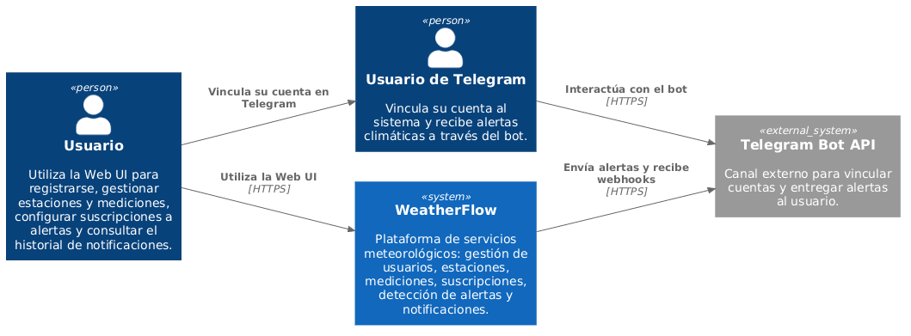
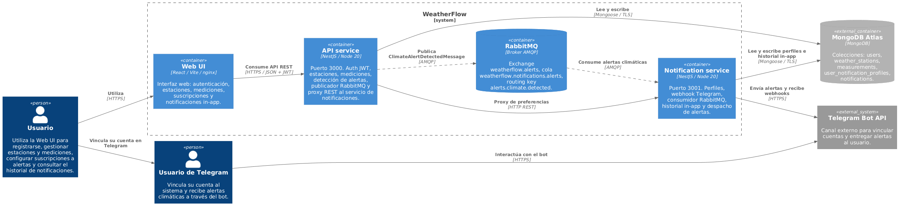
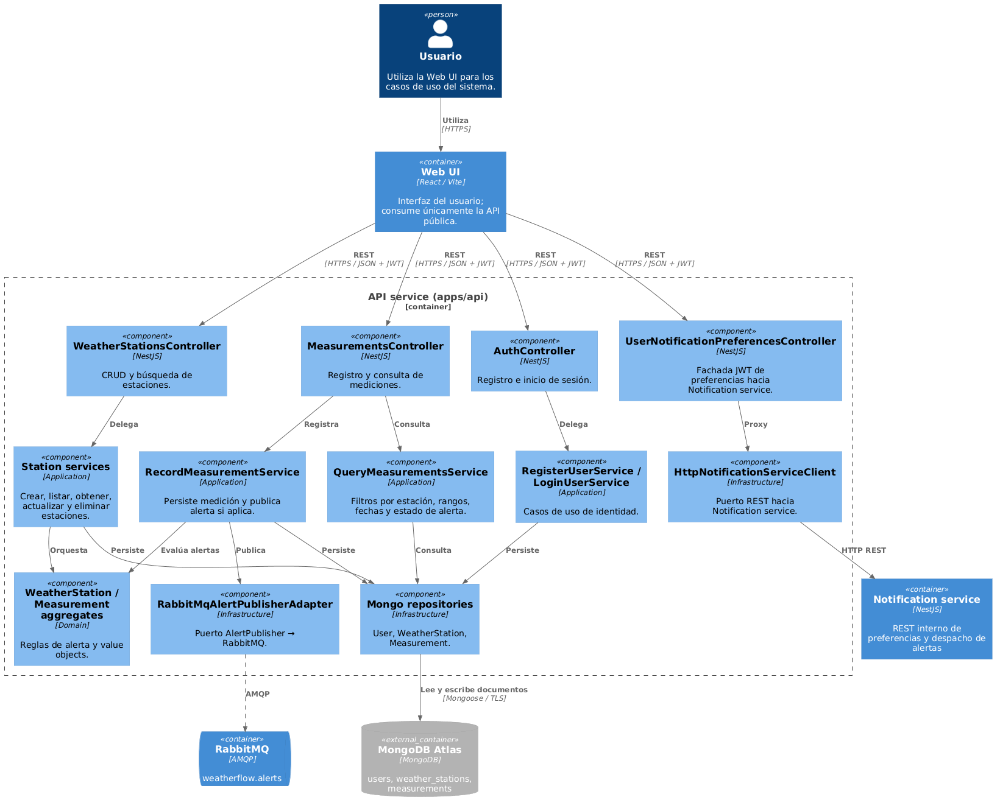
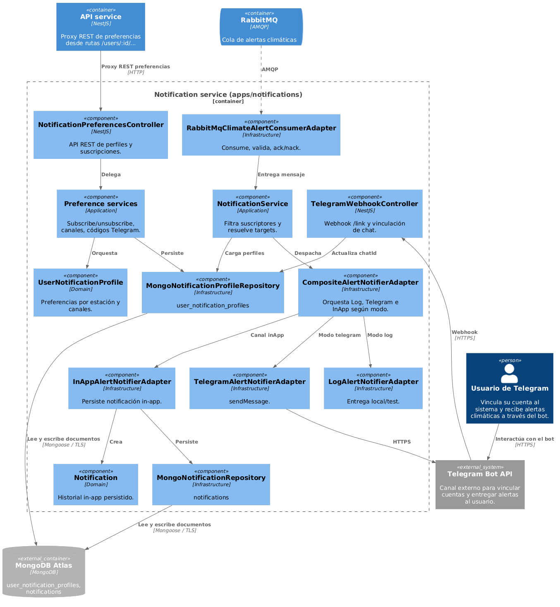

# Arquitectura (modelo C4)

Documentación de **WeatherFlow Delivery II**: plataforma distribuida con API, Notification service, RabbitMQ, MongoDB Atlas y Web UI. Las fuentes están en **PlantUML** con la librería [C4-PlantUML](https://github.com/plantuml-stdlib/C4-PlantUML); las figuras PNG están en esta misma carpeta.

## Nivel 1 — Contexto del sistema

Fuente: [c4_level_1_context.plantuml](c4_level_1_context.plantuml).

WeatherFlow se modela como **caja negra** (`System`). En contexto solo aparece **Telegram Bot API** como sistema externo. Los actores son **Usuario** (Web UI) y **Usuario de Telegram** (misma persona al vincular Telegram). API, Web UI, Notification service, RabbitMQ y MongoDB Atlas son detalle del nivel 2.

## Nivel 2 — Contenedores

Fuente: [c4_level_2_container.plantuml](c4_level_2_container.plantuml).

El **Usuario** accede solo a **Web UI**; la Web UI consume la API. **MongoDB Atlas** y **Telegram Bot API** son servicios externos; RabbitMQ permanece dentro del límite de WeatherFlow.

## Nivel 3 — Componentes (API)

Fuente: [c4_level_3_api.plantuml](c4_level_3_api.plantuml).

Descompone el contenedor **API service**: el **Usuario** interactúa con los controladores a través de **Web UI** (contenedor hermano).

## Nivel 3 — Componentes (Notification service)

Fuente: [c4_level_3_notifications.plantuml](c4_level_3_notifications.plantuml).

Descompone el contenedor **Notification service**. Las preferencias llegan vía proxy desde **API service**; el **Usuario de Telegram** interactúa con **Telegram Bot API**. Incluye adaptadores **Composite**, **Telegram**, **InApp** y **Log**.

---

Ver también [Architecture Overview](../../architecture-overview.md).
