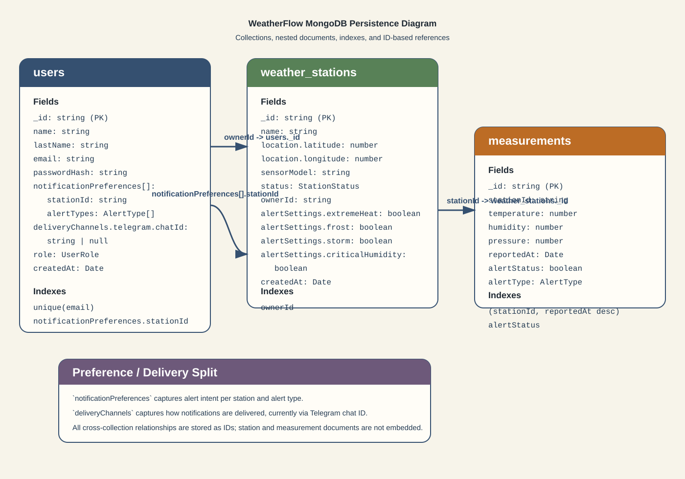

# Database Diagram

This diagram documents the MongoDB persistence model implemented in WeatherFlow. It focuses on the three collections currently managed by Mongoose, the fields stored in each document, the indexes declared in the schemas, and the ID-based relationships between users, weather stations, and measurements.

## Relationship Notes

- `weather_stations.ownerId` references `users._id` to model station ownership.
- `measurements.stationId` references `weather_stations._id` to associate readings with a station.
- `users.notificationPreferences[].stationId` references `weather_stations._id` to model subscription intent without embedding station documents.
- `users.notificationPreferences` stores alert intent, while `users.deliveryChannels` stores channel-specific delivery configuration.

## Index Summary

- `users`: unique index on `email`, plus an index on `notificationPreferences.stationId`
- `weather_stations`: index on `ownerId`
- `measurements`: compound index on `(stationId, reportedAt desc)` and a secondary index on `alertStatus`
